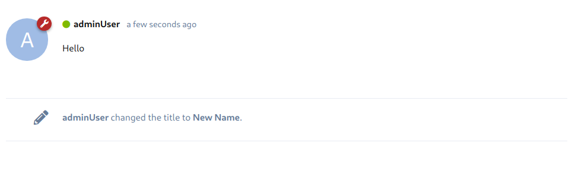

# Custom Post Types

In addition to regular "comment posts", Flarum uses the post system to display meta information about discussions, such as when discussions are renamed, or are moved from one tag to the other. The only post type available by default is the "Discussion Renamed" event post.



To create a custom event post type, you must register it in both the backend and the frontend.

## Backend

Just like regular comment posts, custom post types are stored in, and retrieved from, the database. This means that we will need:

- A database representation of the custom post type
- An Eloquent model to represent the custom post type.
- Logic (perhaps tied to an event handler or command bus handler) to create and save an instance of this model.

### How It Works

By default, event posts are stored in the `posts` database table, alongside regular comment posts. This means that event posts will naturally be included alongside data retrieved from the list posts API endpoint. However, since the content of event posts isn't a block of formatted text, but rather some other data used to represent an event, we use the `content` column to store a serialized version of that data.

For instance, when a discussion is renamed, we want to store the old title and the new title, so that we can display:

`USERNAME changed the title to NEW_NAME`, or `USERNAME changed the title from OLD_NAME to NEW_NAME`

::: tip Think Ahead!
When trying to decide what to save and what not to save in the database, keep in mind that you won't be able to go back in time, and get more than you saved. If you might want to display it later, it might be worth saving it now.
:::

If we look at the relevant code in the `Flarum\Post\DiscussionRenamedPost`, we see exactly this:

```php
public static function reply($discussionId, $userId, $oldTitle, $newTitle)
{
    $post = new static;

    $post->content = static::buildContent($oldTitle, $newTitle);
    $post->created_at = Carbon::now();
    $post->discussion_id = $discussionId;
    $post->user_id = $userId;

    return $post;
}

/**
  * Build the content attribute.
  *
  * @param string $oldTitle The old title of the discussion.
  * @param string $newTitle The new title of the discussion.
  * @return array
  */
protected static function buildContent($oldTitle, $newTitle)
{
    return [$oldTitle, $newTitle];
}
```

::: tip Use Existing Fields
Notice that in the example above, we don't save the username in content, but it's still shown in the screenshot. How is this possible?

Since the 'posts' table has a User ID column, we can use that to link event posts with the users that triggered them. Furthermore, using a foreign key relationship here helps us tie the change to the user more closely.
:::


## Create Your Own

Coming Soon!
