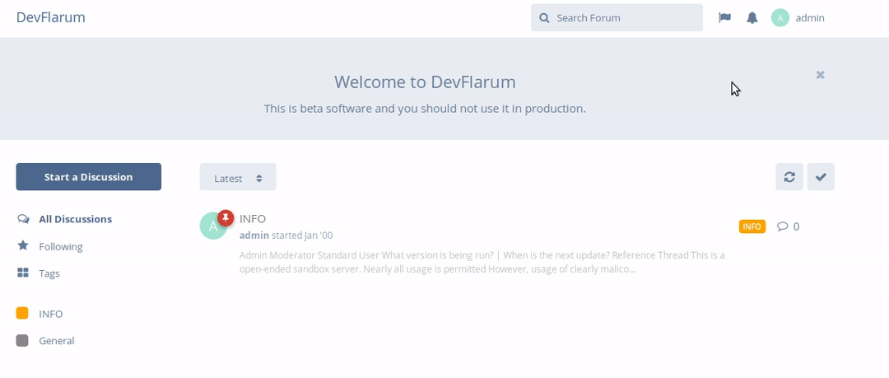
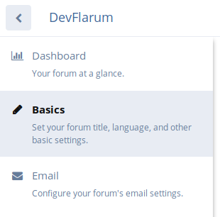
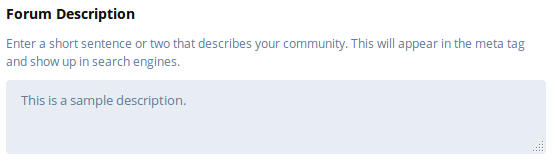

## Changing the Forum Description

Changing the description of your forum instance requires you to be in the Administrator Control Panel, you can do this by clicking your username to the top right of your screen, and then clicking **Administration**. The example below will show you how this is done:

Once you are in the Administration Panel, you'll see some navigation tabs flowing down the left-hand side, click on **Basics** to reveal the configuration page to the right-hand side.

On the configuration page to the right, you'll see **Forum Description** with a box underneath to write in as shown below:

Write a few words which generally describe what kind of forum community you are creating then click on **Save Changes**.

Once you've one that, to the top left of your screen, there will be an arrow pointing to the left as shown below:

Click the arrow, which will then take you back to your forum's main page.

Easy as that!
