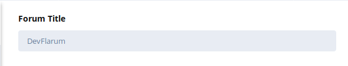
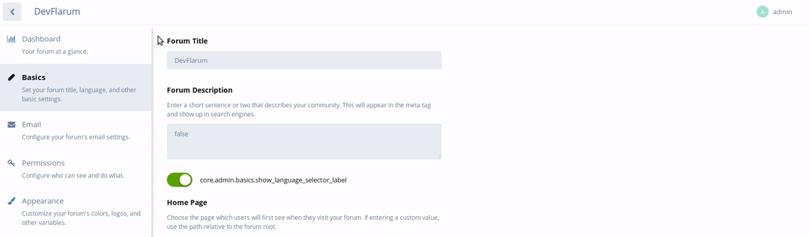

## Changing the Forum Title

Changing the title of your forum instance requires you to be in the Administrator Control Panel, you can do this by clicking your username to the top right of your screen, and then clicking **Administration**. The example below will show you how this is done:

Once you are in the Administration Panel, you'll see some navigation tabs flowing down the left-hand side, click on **Basics** to reveal the configuration page to the right-hand side.

At the top of the configuration page, you'll see _Forum Title_ underneath will be a box with your **current** forum title written in.

Replace the text with your desired forum title and then click on _**Save Changes**_

Once you've one that, to the top left of your screen, there will be an arrow pointing to the left as shown below:

Click the arrow, which will then take you back to your forum's main page, with your new forum title in place.
