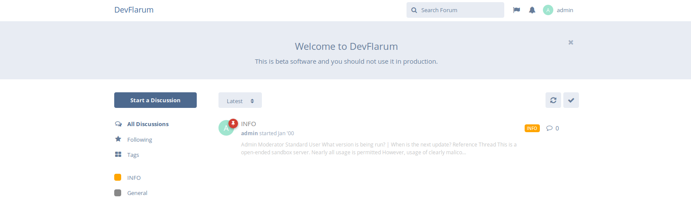
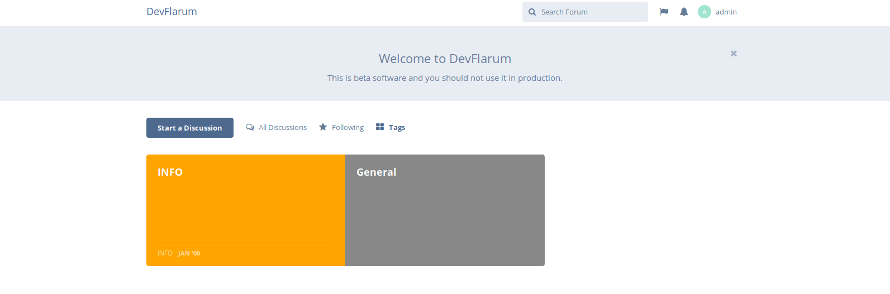

## User Handbook
### Switching Home Page Display Options

Changing the home page display layout of your forum instance requires you to be in the Administrator Control Panel, you can do this by clicking your username to the top right of your screen, and then clicking **Administration**. The example below will show you how this is done:

Once you are in the Administration Panel, you'll see some navigation tabs flowing down the left hand side, click on **Basics** to reveal the configuration page to the right hand side.

Please note: The information below **Requires** the **Tags Extension** to be **Enabled** (which is enabled by default), otherwise this will not function as guided below.

Depending on what kind of extensions you have installed, there may also be other view options available for you to use. In this guide, we are using a fresh standard installation, with no additional extensions other than the defaults.

### All Discussions

Having this radio button set will display the most recent discussions by default on the forum main page (home page), sticky topics will of course remain at the very top of the board.

The **All Discussions** option makes the forum look like this:

### Tags

This radio button will set your forum's main page (home page) to display your set tags only, you'll have to click whichever category you wish to view before any discussions will appear.

The **Tags** option will make the forum look like this:

Setting any of these options will set it for **everybody** there is currently no way to set this for individual users, so bear that in mind when making the decision which one suits your forum the best.

You can of course switch the radio buttons at anytime you wish to, should you feel the current selection does not suit your needs.
