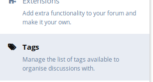
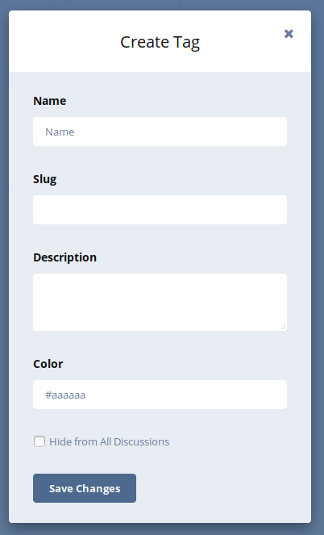
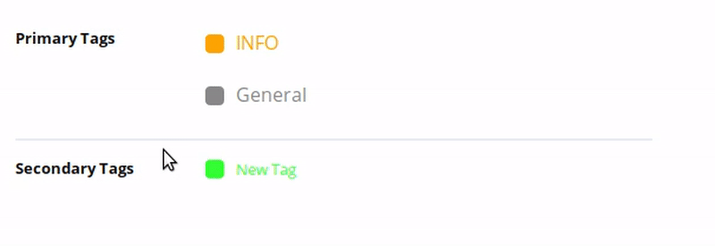
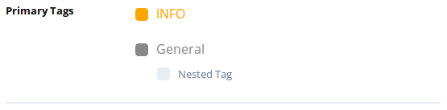
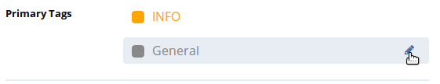
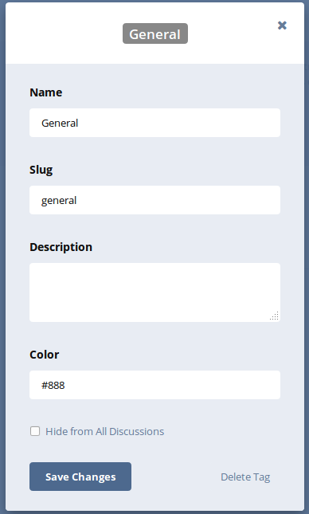
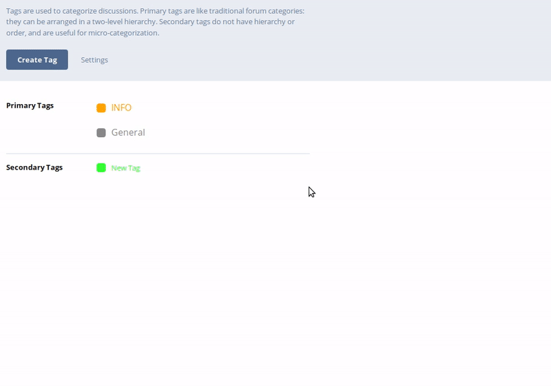

## User Handbook

Please note: The information below **Requires** the **Tags Extension** to be **Enabled** (which is enabled by default), otherwise, this will not function as guided below.

Managing your forum tags requires you to be in the Administrator Control Panel, you can do this by clicking your username to the top right of your screen, and then clicking **Administration**. The example below will show you how this is done:

Once you are in the Administration Panel, you'll see some navigation tabs flowing down the left-hand side, click on **Tags** to reveal the configuration page to the right-hand side.

### Creating a new Tag

A tag is a way of categorizing posts made by a user, they are primarily set by the staff of the forum (admins).

#### Secondary Tags

On the configuration page for **Tags** you'll need to click **Create Tag** which will bring up the create tag box:

### Create Tag Components

#### Name:

The name is what you'd like the tag to be called, also known as the category title.

#### Slug:

The slug is a string that goes into the URL, essentially it's a version of the name of the tag that is all lower-case, and uses dashes instead of spaces.

Unless you need to, you generally don't need to do anything with this, as when you type in the **Name** the slug auto-fills in.

#### Description:

The description of the tag will appear alongside the **name** in the tag selection post when making a post, it's a short few words giving a more in-depth description of the category it belongs to.

#### Color:

This is the color you would like the tag to appear in on the posts, and forums, the color box uses **HTML Color Codes** beginning with a **#** you can Google around for HTML Color Codes, there are plenty of websites on this.

Once you've filled in the appropriate information in the Create Tag prompt, click on **Save Changes** to add the new tag.

### Moving the Tag between Primary, and Secondary tags

By default, new tags created will be **Secondary Tags** also known as **Sub Categories**, sometimes you'll want these to be primary tags, to do this, click and drag the tag to the **Primary** slot at the top, follow the below animation to see how this is done:

Nested Tags can also be created using the same method shown above however will need to be dragged closer to its primary tag, nested tags will look like the screenshot below:

### Deleting & Editing a Tag

To edit a Tag, you'll first need to access the Tag Editor, this can be done by clicking the **Pencil Icon** as shown below on the desired tag:

This will bring up the **Tag Editor** screen, with the following information:

To make changes, modify the content in the desired text boxes and then click **Save Changes**.

***Hide from All Discussions*** is an option used to prevent any Discussions this tag is attached to from being displayed on the **All Discussions** home page view.

The **Delete Tag** button also resides at the bottom right hand of the Tag Editor, to remove the tag, follow the animation below:

