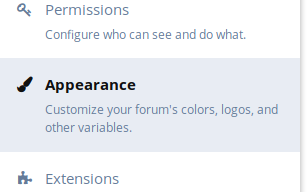
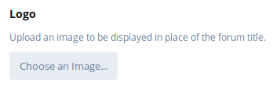
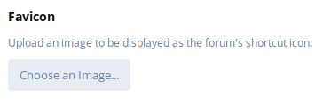

## User Handbook
### Uploading a custom logo & favicon

To upload a custom logo to your forum instance requires you to be in the Administrator Control Panel, you can do this by clicking your username to the top right of your screen, and then clicking **Administration**. The example below will show you how this is done:

Once you are in the Administration Panel, you'll see some navigation tabs flowing down the left-hand side, click on **Appearance** to reveal the configuration page to the right-hand side.

Under the **Logo** label, you'll find a button which is labeled **Choose an image...**, click that which will bring up the file upload prompt, find the image you wish to upload them click **Open**

To upload a custom favicon, do the same as above, only under the **Favicon** label.

Once you're done with the uploading, click **Save Changes** at the bottom to save your new logo and favicon!
