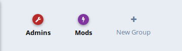
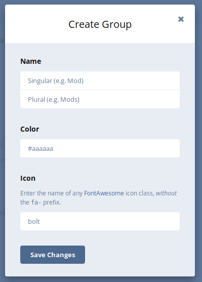
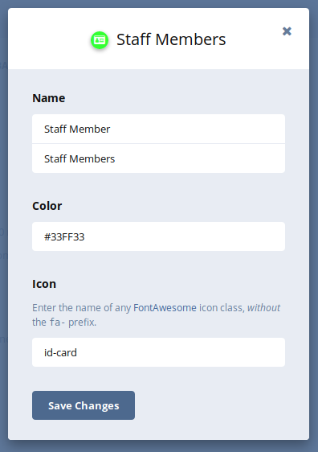

## User Handbook
### Creating, Deleting and Modifying User Groups

Managing user groups on your forum instance requires you to be in the Administrator Control Panel, you can do this by clicking your username to the top right of your screen, and then clicking **Administration**. The example below will show you how this is done:


Once you are in the Administration Panel, you'll see some navigation tabs flowing down the left hand side, click on **Permissions** to reveal the configuration page to the right hand side.


User groups are used for all kinds of different purposes, Flarum has a fantastic management system which makes it super-easy to manage user groups, and their associated permissions.

### Create a new User Group

On the configuration page, you'll see some pre-created user groups (if your Flarum installation is a fresh install), these are Admins & Mods, as shown below:



Next to those user groups, you'll see **New Group** click that to bring up the **Create Group** prompt.



There are 4 pieces of information Flarum needs from you to create this new user group, for this example we're going to be creating a user group called **Staff Member** but you can name this anything you wish.

### Create Group Form Components

#### Name

 - Singular: is how the name is written should it only apply to one person, in this example our Singular name is **Staff Member**
 - Plural: is how the name is written should it apply to more than one person, this example would be named **Staff Members**
 
#### Color

Choosing a Color can be done by obtaining the HTML Color Code of your desired color, there are plenty of websites you can view which a quick Google search would give you. Enter the color code you wish to use (starts with a **#**).

#### Icon

The Icon is a small picture that goes at the side of your user avatar in posts to signify that you are a member of this particular user group. To pick your icon, you'll need to visit [this website](http://fontawesome.io/icons/) to pick out your icon, for this example we will be using the ```id-card``` icon. In this field, you'll just need to write "id-card" (without the quotation brackets) and then we're done!

Once you've filled in the form, it should look something like this:



Click on **Save Changes** once you've completed the form, which will then create your new user group!

### Delete a User Group

Deleting a user group is very simple, at the top of the configuration page, you'll see all the user groups that you've created, click on the user group that you wish to **delete** which will bring up the user group editing box, bring your mouse to the bottom right of that box over the **Delete group** link, click that and then click **OK** to the warning that comes up. Boom! the user group is now deleted.

### Modifying a User Group

On the configuration page at the top, go ahead and click on the user group that requires editing to bring up the group editing box, when it displays, make the edits that you feel are necessary. Once you are done with that, click on **Save Changes** to update the groups settings with your edits.
