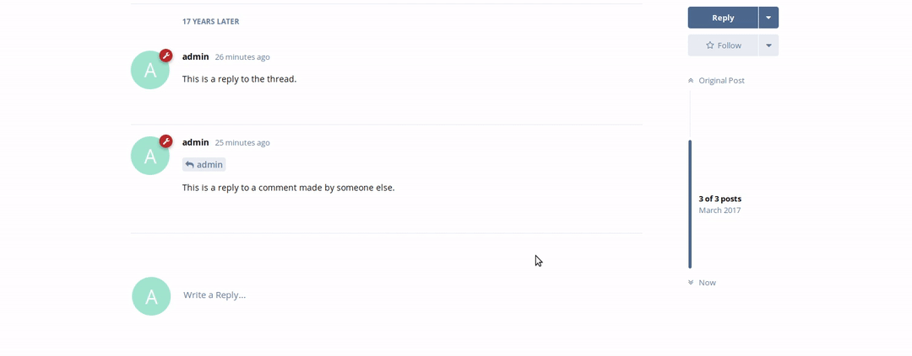

## Liking a post

Please note: This guide will **Require** the **Likes Extension** to be **Enabled** (which it is by default) otherwise it will not function as intended.

So, you want to show someone appreciation of their post? that's cool! let's show you how.

In the world of Social Media, everyone is (or at least should be) in the knowledge of what a **like** is, but for the stone-agers, a "Like" is a small way of saying to the user "Hey, you're post is cool! thanks" without having to type it - or anything for that matter (seriously!).

Simply bring your mouse to the bottom right of the post you wish to like, and press the like link. Simple as that! to unlike a post, it's simply the same process. The animation below will show all you need to know.

