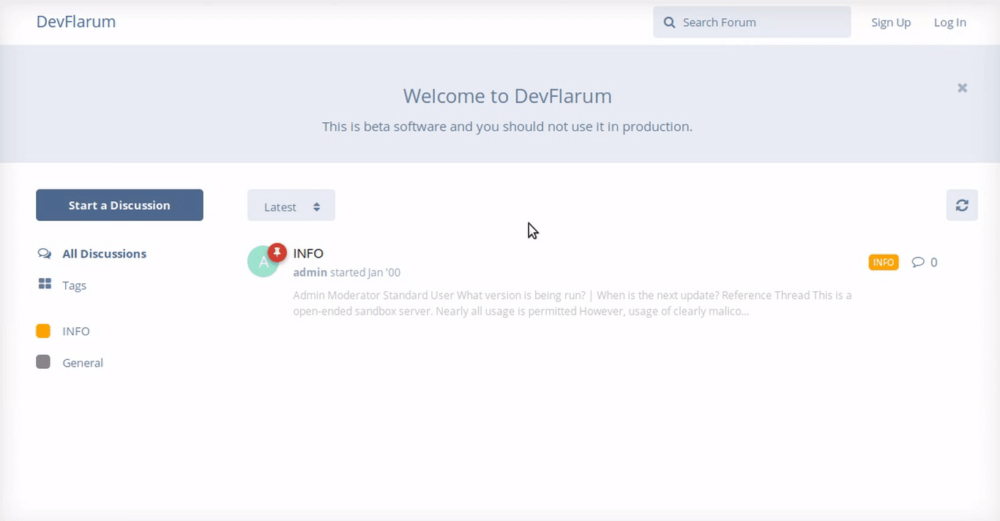

## User Handbook
### Logging In

Once you have [created a user account](https://github.com/Arkinn/docs/blob/testing/guide/registration.md) the next step to interacting with the community will be to login.

The login screen can be accessed by clicking **Log In** at the top right of the screen, the animation below will show you what this looks like:

Enter your **Username** _OR_ **e-mail address** and **Password** that you filled out during the [sign up process](https://github.com/Arkinn/docs/blob/testing/guide/registration.md) and then click Log In. 

Once you are successfully logged in, you'll see your avatar, and username in the top right hand corner of the screen, which looks like:

