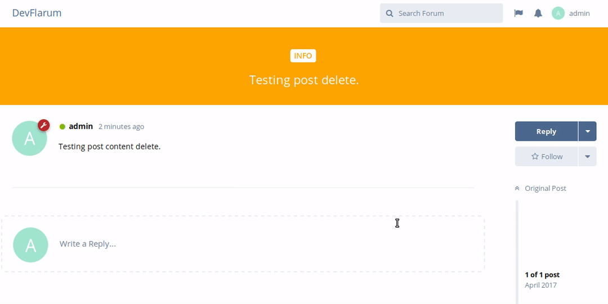
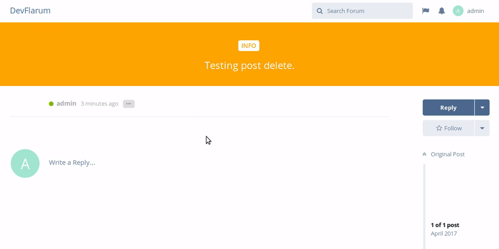

## Deleting a Users Post

Deleting a post made by someone else is easy, but has 2 stages, which are outlined in detail below.

As always, firstly you'll want to find the post that needs deleting. Once you have, hover your mouse to the right, the lower side of the post area to bring up the _post menu_ click on that and then click **Delete**.

Be aware though, clicking **Delete** will only soft-delete the post, meaning, for now, the post will remain there in the non-live state. This gives you the opportunity to restore the post should you think you have made a mistake, or want another mod to review it, etc.

The option to Delete looks like this:

To permanently delete the post, once you are **sure you want it removed** then go ahead and expand the post, by clicking on the _expand button_ next to the username of the poster, once the post is expanded, do the same as you did in the last step, click on the _post menu_, this will bring up the option to **Delete Forever** as shown below:

Once you've clicked on **Delete Forever** the post will be permanently removed from the database.
