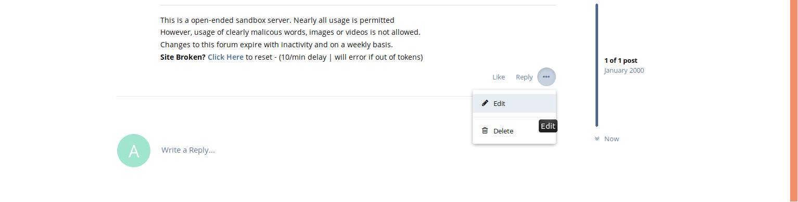
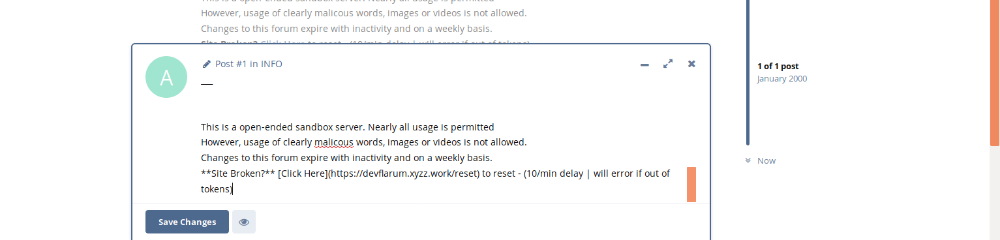

## User Handbook

### Editing a User's Post

So, you need to edit a users post? simple, let's show you how!

Firstly, you'll need to find the post in question, once you are there, hover your mouse over the right, lower side of the post area. You'll see _post menu_. Click on that, and as the screenshot below will show, you'll have the option to edit the selected post.

Once you've clicked on **Edit** you'll be given a content edit box at the bottom of the screen, as the screenshot will show you:

Feel free to make any adjustments you need to in that box, once you have completed your edits, click on **Save Changes**.

Your changes will be live immediately, and to confirm a successful edit, there will be a small note at the top of the post, as shown below:

