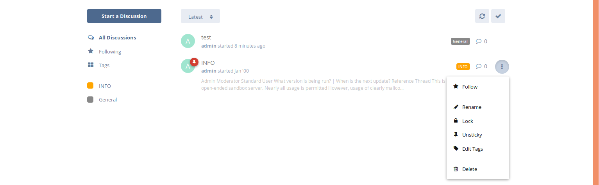

## User Handbook

## Locking a Discussion

To lock a discussion, as always you'll first need to find the discussion in threaded view, once you have go ahead and bring up the thread menu by hovering the mouse over the right of the thread, and selecting the three dots menu, as show in the screenshot below:

With the menu, click on the **Lock** label which will immediately lock the thread, preventing any futher replies. A confirmation of the thread lock will be a padlock over the user's avatar as shown below:

