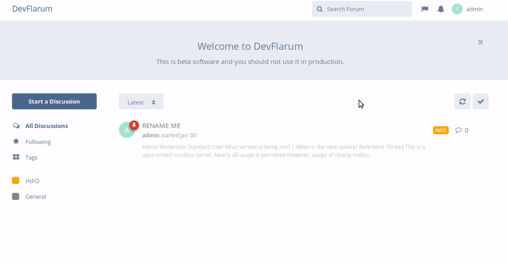

## User Handbook

## Renaming a Discussion

To rename a discussion, you'll first need to find it in the threaded view on the home page of the forums, hover the mouse to the right of the thread section, bring up the thread menu which you can do by following the animation below:

Go ahead and click on **Rename** as shown above, which will display a box where you can rename the discussion (as above again).

Enter a new name for the discussion then click on **Rename** which will save the new discussion name, and immediately display it on the page for you.
