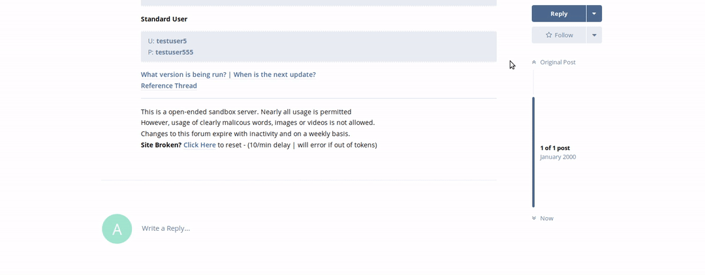

## Making a Reply to a Post

Using this method will create a fresh reply, with no mentions or ties to any other comment on the page (Unless you insert them manually).

To do this:

 - Click on the **Reply** button to the right of the page, above the infinity scroller.
 - Once the reply box displays, type your desired response to the thread.
 - Click on the **Post Reply** button at the bottom left of the box.
 
You will see your reply go live almost immediately for both you, and everyone else to see. The below animation will also show you visually how it's done.

If you want to create a reply to someone's comment, then you'll want to view [this link](replycomment.md) to see how it's done!
