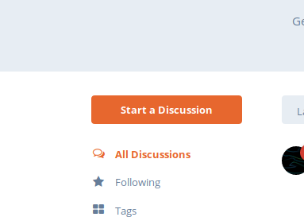
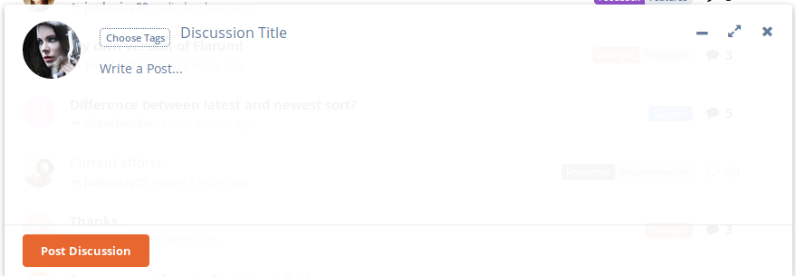
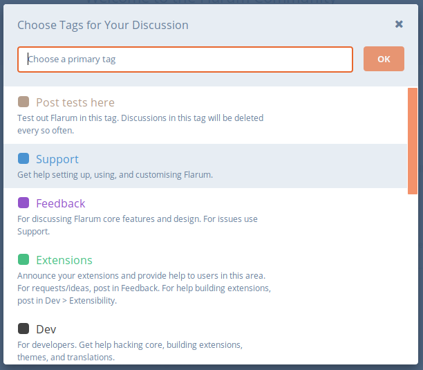

## Starting a Discussion

Discussions can be started once you are logged in, to begin, click on **Start a Discussion** to the left-hand side of your screen. The button for this looks like this:

Once that button is pressed, at the bottom center of your screen, the discussion dialogue box will appear so you can start your discussion, the box looks like this:

### Form Components

#### Tags

On the form, you'll need to select some tags to categorize what you are talking about. Click on "Choose Tags" from the screenshot above, and the following page will display:

Select the tags you think are appropriate, or relevant to your discussion, and then click "Ok" to apply them.

#### Discussion Title

Discussion Title is giving a very short, brief subject on your discussion, for example, if you wanted to start a discussion about the weather today, then your Title would be something along the lines of "The Weather Today".

#### Write a post

This is where you expand in more detail about what you want to talk about, feel free to go crazy here! (although, not too crazy!).

Once you've included everything you want to, go ahead and click "Post Discussion". This will make it immediately live, and available on the forums for other people to reply to, and interact with. Congratulations, you've just started your first discussion!
