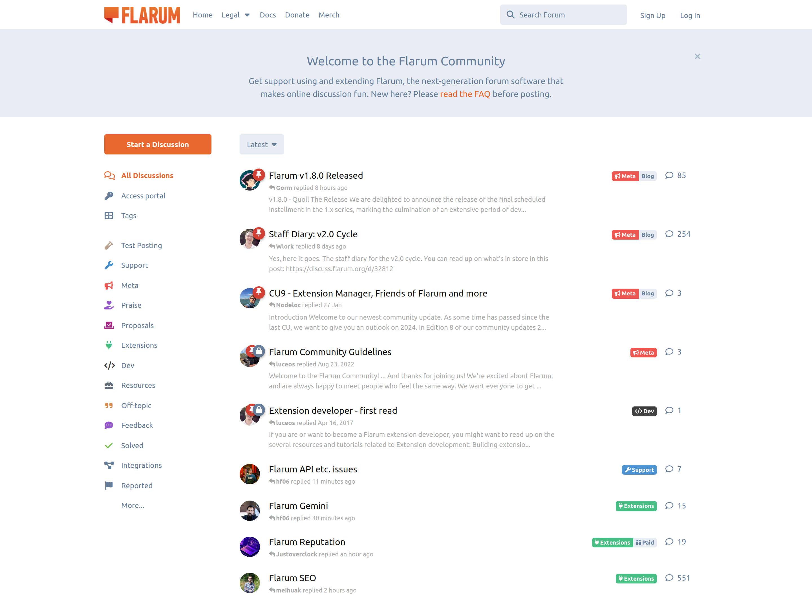

- - -
slug: /
- - -

# Über Flarum

Flarum ist eine herrlich einfache Diskussionsplattform für deine Website. Es ist schnell, kostenlos und benutzerfreundlich und bietet alle Funktionen, die du für den Betrieb einer erfolgreichen Community benötigst. Zudem ist Flarum äußerst erweiterbar und lässt sich optimal anpassen.

## Ziele

Flarum ist der kombinierte Nachfolger von [esoTalk](https://github.com/esotalk/esoTalk) und [FluxBB](https://fluxbb.org). Flarum ist:

* **Schnell und einfach.** Kein Durcheinander, kein Ballast, keine komplexen Abhängigkeiten. Flarum wurde mit PHP erstellt, sodass es schnell und einfach bereitgestellt werden kann. Die Oberfläche wird mit [Mithril](https://mithril.js.org) betrieben, einem leistungsstarken JavaScript-Framework mit geringem Platzbedarf.

* **Schön und responsiv.** Dies ist eine Forensoftware für Menschen. Flarum wurde sorgfältig entwickelt, um plattformübergreifend konsistent und intuitiv zu sein, und zwar sofort nach der Installation.

* **Leistungsstark und erweiterbar.** Passe Flarum an, erweitere es und integriere es in deine Community. Die Architektur von Flarum ist erstaunlich flexibel, mit einer [leistungsfähigen Erweiterungs-API](/extend/README.md).

* **Kostenlos und Open Source.** Flarum wird unter der [MIT-Lizenz](https://github.com/flarum/flarum/blob/master/LICENSE) veröffentlicht.

Mehr über unsere [Philosophie und Werte für Flarum kannst du hier lesen](https://discuss.flarum.org/d/28869-flarum-philosophy-and-values).

## Unterstütze das Flarum-Projekt

Flarum ist eine [kostenlose, quelloffene](https://github.com/flarum/core) Software, die von Freiwilligen gepflegt und verwaltet wird. Wir sind auf die Beiträge der Community angewiesen, damit wir Flarum verbessern und erweitern können.

🧑💻 Wenn du ein Entwickler bist, solltest du in Erwägung ziehen, [zum Kern oder den gebündelten Erweiterungen von Flarum beizutragen](contributing.md). Dies ist **die** effizienteste Art, Flarum zu helfen, und Ihre Arbeit kann viel bewirken: Es gibt Tausende von Flarum-Seiten mit insgesamt Millionen von Endnutzern.

🧩 Wenn du eine Funktion vermisst oder eine Idee für ein Thema hast, [schreibe eine individuelle Erweiterung](extend/README.md), um Flarum für dich und andere zu verbessern.

✒️ Wenn du Erfahrung im technischen Schreiben hast, könnten deine Beiträge zu [unserer Dokumentation](https://github.com/flarum/docs/issues) zukünftigen Benutzern, Administratoren und Entwicklern helfen, das Beste aus Flarum zu machen.

🌐 Wenn du mehrere Sprachen sprichst, könntest du [Übersetzungen](extend/language-packs.md) beisteuern, um Flarum für unzählige Nutzer auf der ganzen Welt zugänglich zu machen.

💸 Die Flarum Foundation verdient kein Geld mit Flarum, hat aber Rechnungen zu bezahlen. Spenden über [GitHub Sponsors](https://github.com/sponsors/flarum) oder [OpenCollective](https://opencollective.com/flarum) werden immer dankbar angenommen. In der Vergangenheit konnten wir auch einige unserer Hauptentwickler finanziell unterstützen, damit sie in Teilzeit an Flarum arbeiten konnten. Dies wäre ohne eure finanzielle Unterstützung nicht möglich gewesen.

🧑🤝🧑 Tritt [unserer Community](https://discuss.flarum.org) bei, um über die Entwicklung von Flarum zu sprechen, Hilfe für deine Instanz zu bekommen oder einfach coole Leute zu treffen! Wenn du Erfahrung mit Flarum hast, kannst du auch gerne Anfängern helfen!

🐛 Wenn ein Fehler existiert, der dich stört, oder eine Idee für eine neue Funktion, die dir durch den Kopf geht, können wir es nicht wissen, wenn du es uns nicht sagst! Wir verfolgen Bugs, Vorschläge und zukünftige Entwicklungspläne [über GitHub](https://github.com/flarum/core/issues). Wenn bereits ein offenes Problem existiert, können Likes und (konstruktive) Zusatzinformationen sehr hilfreich sein!

📣 Und wenn dir Flarum gefällt, dann erwäge doch darüber zu bloggen/twittern/reden! Mehr Aufmerksamkeit für Flarum führt zu mehr Nutzern, die sich mit Flarum beschäftigen, und damit zu mehr Aktivität, besseren Erweiterungen und einer schnelleren Entwicklung.

Flarum wäre ohne unsere phänomenale Community nicht möglich. Wenn du daran interessiert bist, einen Beitrag zu leisten, findest du weitere Informationen in den Dokumenten für [Entwicklerbeiträge](contributing.md) und andere [Beiträge](contributing-docs-translations.md).
