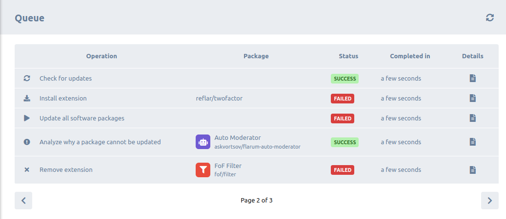

# Extension Manager
This contains an explanation of how the extension manager works and what it has to offer.

slightly outdated: see [the extensions guide for more](/extensions.md).

## Inhalt
* Installieren, Aktualisieren und Entfernen von Erweiterungen.
* [Nach Updates suchen](#checking-for-updates).
* [Global Flarum-Update](#global-flarum-updates).
* [Patch-Minor Flarum-Updates](#patch-minor-flarum-updates).
* [Major Flarum-Update](#major-flarum-updates).
* [Flarum-Updates (global, minor, major)](#flarum-updates-global-minor-major).
* [Hintergrundaufgaben](#background-tasks).

## Anforderungen
Es existieren einige Hindernisse, die behoben werden müssen, bevor dies verwendet werden kann.

### Dateiberechtigungen
Der relevante Computer-Webbenutzer muss über Lese- und Schreibberechtigungen für Folgendes verfügen: `vendor`, `composer.json`, `composer.lock` und `storage`. Im Moment erscheint eine Warnung, wenn dies nicht der Fall ist, sollte dies vorzugsweise geändert werden, um nur die Dateien/Verzeichnisse zu erwähnen, in denen Berechtigungen fehlen, anstatt alle.

### Pfad-Repository
In Entwicklungsumgebungen (und Produktion in seltenen Szenarien) sollte ein Pfad-Repository zu einem Verzeichnis existieren, das (meistens Entwicklungs-) Pakete enthält, der Pfad zu diesem Verzeichnis muss in einen absoluten Pfad geändert werden, da Composer sonst Probleme haben wird, einen Befehl auszuführen. Additionally the path repository by default has higher priority, so requiring an extension that exists in that repository will probably fail, unless a `*@dev` constraint is specified, in which case the extension manager should not be used for dev purposes anyway.

There is currently now hint of any of this in the extension manager UI.

## Gemeinsame Aktionen
Jede der oben aufgeführten Funktionen ist im Grunde ein oder zwei Composer-Befehle, und es existieren gemeinsame Aktionen/gemeinsames Verhalten zwischen ihnen allen.

* Einschränkung des Zugriffs auf den Administrator.
* Validierung des bereitgestellten Paketnamens oder der Erweiterungs-ID, falls angegeben.
* Fehler beim Installieren einer vorhandenen Erweiterung, Aktualisieren oder Entfernen einer nicht vorhandenen Erweiterung usw
* Ausführen des Befehls. Dies [protokolliert die Ausgabe automatisch](#command-output-logging).
* [Fehler bei Befehlsfehler](#command-failure).
* Versenden eines Ereignisses.
* Wenn Du ein Update ausführst:
  + Cache leeren.
  + Migrationen ausführen.
  + Assets veröffentlichen.
  + Aktualisierungsprüfung durchführen und alle Erweiterungen protokolliere, die im Aktualisierungsprozess nicht auf ihre neuesten Versionen aktualisiert wurden.

### Protokollierung der Befehlsausgabe
In Anbetracht dessen, dass dies noch experimentell ist und insbesondere aus Gründen der einfacheren Unterstützung, wird jede Befehlsausgabe genau wie die Flarum-Fehlerprotokolle in `storage/logs/composer` protokolliert, sodass Du zurückgehen und sehen kannst, was während einer Befehlsausführung geschehen ist.

### Befehlsfehler
Wenn ein Composer-Befehl fehlschlägt (erkannt durch den Exit-Code), wird eine Ausnahme ausgelöst, die einen Grund enthält, der von der Ausnahme basierend auf dem Ausgabetext des Befehls erraten wird. Geschätzte Ursachen werden im Frontend in ordnungsgemäß erklärende Warnmeldungen umgewandelt.

## Nach Updates suchen
Dies führt den Befehl `composer outdated -D --format json` aus, der nach Aktualisierungen von Paketen sucht, die direkt im Stammverzeichnis `composer.json` erforderlich sind, und die Ergebnisse im JSON-Format ausgibt. Nur Pakete, die von Composer als `semver-safe-update` und `update-possible` gekennzeichnet sind, werden angezeigt.

Die Informationen zum letzten Update-Check werden in einer JSON-Einstellung gespeichert.

## Global Flarum Updates
Einfach den Befehl `command update --prefer-dist --no-dev -a --with-all-dependencies` ausführen, was nützlich ist, um alle Pakete zu aktualisieren.

## Patch-Minor Flarum Updates
Dieser ändert direkt benötigte Paketversionen auf `*` und führt dann den Befehl `command update --prefer-dist --no-dev -a --with-all-dependencies` aus.

## Major Flarum Updates
Dadurch werden die direkt erforderlichen Paketversionen auf `*` geändert, der Kern auf die neueste Hauptversionsanforderung geändert und dann derselbe Befehl oben ausgeführt. Bei einem Fehler kann richtig vermutet werden, dass einige Erweiterungen nicht mit der neuen Hauptversion kompatibel sind, die Ausnahmedetails enthalten eine Reihe von Erweiterungspaketnamen, die nicht kompatibel sind, es wird im Frontend gerendert, mit der Möglichkeit, ein `composer Why-not Flarum/Core 2.0` für weitere Details auszuführen.

## Flarum Updates (global, minor, major)
Informationen über die zuletzt ausgeführten Updates werden in einer `last_update_run` JSON-Einstellung gespeichert, die ein Array von Erweiterungspaketnamen enthalten kann, die während des Prozesses nicht auf ihre neueste Version aktualisiert wurden. Dies wird im Frontend als Warnsymbolschaltflächen auf der Wenn Sie auf Erweiterungselemente klicken, wird ein `composer why-not` ausgeführt, das die Details des Fehlers in einem Modal anzeigt.

 

## Hintergrundaufgaben
Um Zeitüberschreitungsprobleme zu umgehen, können Composer-Befehle auch im Hintergrund ausgeführt werden, indem die Warteschlange verwendet wird. Benutzer können auf [Blomstras Datenbankwarteschlangenimplementierung](https://discuss.flarum.org/d/28151-database-queue-the-simplest-queue-even-for-shared-hosting) als grundlegende Warteschlangenlösung verwiesen werden. Es enthält Anweisungen zum Aktivieren der Warteschlange über einen Cron-Job.

:::danger Cron-Job PHP-Prozessversion

Es ist üblich, dass gemeinsam genutzte Hosts eine niedrige PHP-Version in SSH verwenden. Benutzer müssen darauf hingewiesen werden, dass sie sicherstellen müssen, dass der PHP-Prozess eine mit Flarum kompatible Version hat. Entweder durch manuelle Überprüfung oder durch Nachfragen bei ihren Gastgebern.

:::

## ZUTUN
- Mit Shared Hosting versuchen.
- Bessere Erklärung auf der Benutzeroberfläche zu Hintergrundaufgaben.
