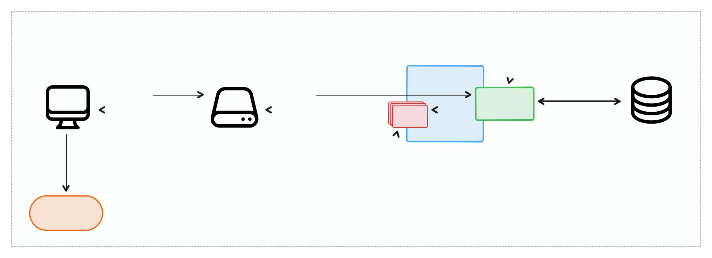

# 接口与数据流

在[上一篇文章中](models.md), 我们学习了Flarum是如何通过模型与数据交互的。 在这里，我们将学习如何将数据从数据库到 JSON-API 再到前端，然后再返回。

:::info

若要在集成项目中使用内置的 REST API，可参考[Consuming the REST API](../rest-api.md)这份文档 / 章节。

:::

## API请求生命周期

在我们详细了解如何扩展Flarum的数据 API 之前，值得考虑一个典型的 API 请求的生命周期：



1. HTTP请求已发送到Flarum的 API。 通常情况下，这将来自Flarum前端，但外部程序也可以与 API 互动。 An HTTP request is sent to Flarum's API. Typically, this will come from the Flarum frontend, but external programs can also interact with the API. Flarum's API mostly follows the [JSON:API](https://jsonapi.org/) specification, so accordingly, requests should follow [said specification](https://jsonapi.org/format/#fetching).
2. 请求运行到 [middleware](middleware.md)并路由到适当的 API 资源端点。 每个API资源都有一个唯一的类型，并且有一组端点。 你可以在以下章节中阅读更多关于这些问题的内容。
3. 扩展通过 [`ApiResource` 扩展器](#extending-api-resources) 对 API 资源端点所做的所有修改，都会被自动应用生效。 这可能需要更改排序，添加包括加载关系，或在默认实现运行之前或之后执行一些逻辑。
4. 端点的动作被调用，产生了一些原始数据，返回给客户端。 通常，这些数据将采取Laravel Espoent模型收集或实例的形式，已从数据库中检索。 That being said, the data could be anything as long as the API resource can process it. There are built-in reusable endpoint for CRUD operations, but custom endpoints can be implemented as well.
5. Any modifications made through the [`ApiResource` extender](#extending-api-resources) to the API resource's fields will be applied. These can include adding new attributes or relationships to serialize, removing existing ones, or changing how the field value is computed.
6. The fields (attributes and relationships) are serialized, converting the data from the backend database-friendly format to the JSON:API format expected by the frontend.
7. The serialized data is returned as a JSON response to the frontend.
8. 如果请求是通过 Flarum 前端的 `Store`发出的，返回的数据 (包括任何相关对象) 将作为 [frontend models](#frontend-models)存储在前端存储中。

## API Resources

We learned how to use models to interact with data, but we still need to get that data from the backend to the frontend. We do this by writing an API Resource for the model, which defines the fields (attributes and relationships) of the model, the endpoints of the resource API, and optionally some extra logic, such as visibility scoping, sorting options, etc. We will learn about this in the next few sections.

CRUD endpoints are provided by Flarum, so you can simply add them to your API resource's `endpoints()` method. They are:

- `Index`: Listing many instances of a model (possibly including searching/filtering)
- `Show`: Getting a single model instance
- `Create`: Creating a model instance
- `Update`: Updating a model instance
- `Delete`: Deleting a single model instance

:::info

Flarum uses a forked version of Toby Zerner's [json-api-server](https://tobyzerner.github.io/json-api-server/). So some of what is documented there applies in Flarum, but not everything is the same.

:::

:::tip [Flarum CLI](https://github.com/flarum/cli)

You can use the CLI to automatically create your API resource:
```bash
$ flarum-cli make backend api-resource
```

:::

***Example:*** if you had a `Label` model, the `LabelResource` you would create could look something like this:

```php
namespace Acme\Api;

use Acme\Label;
use Flarum\Api\Context;
use Flarum\Api\Endpoint;
use Flarum\Api\Resource\AbstractDatabaseResource;
use Flarum\Api\Schema;

/** @extends AbstractDatabaseResource<Label> */
class LabelResource extends AbstractDatabaseResource
{
    public function type(): string
    {
        return 'labels';
    }

    public function model(): string
    {
        return Label::class;
    }

    public function scope(Builder $query, Context $context): void
    {
        $query->whereVisibleTo($context->getActor());
    }

    public function endpoints(): array
    {
        return [
            Endpoint\Show::make(),
            Endpoint\Create::make()
                ->authenticated()
                ->can('createLabel'),
            Endpoint\Update::make()
                ->authenticated()
                ->can('edit'),
            Endpoint\Delete::make()
                ->authenticated()
                ->can('delete'),
            Endpoint\Index::make()
                ->defaultInclude(['parent']),
        ];
    }

    /*
     * This is only for endpoint processing and serialization.
     * You still have to create a database migration to add the table/columns.
     */
    public function fields(): array
    {
        return [
            Schema\Str::make('name')
                ->requiredOnCreate()
                ->writable(),
            Schema\Str::make('description')
                ->writable()
                ->maxLength(700)
                ->nullable(),
            Schema\Str::make('slug')
                ->requiredOnCreate()
                ->writable()
                ->unique('labels', 'slug', true)
                ->regex('/^[^\/\\ ]*$/i'),
            Schema\Str::make('color')
                ->writable()
                ->nullable()
                ->rule('hex_color'),
            Schema\Str::make('icon')
                ->writable()
                ->nullable(),
            Schema\Boolean::make('isActive')
                ->writable(),
            Schema\DateTime::make('createdAt'),
            Schema\Boolean::make('canAddToDiscussion')
                ->get(fn (Tag $tag, FlarumContext $context) => $context->getActor()->can('addToDiscussion', $tag)),

            Schema\Relationship\ToOne::make('user')
                ->type('users')
                ->includable(),
            Schema\Relationship\ToOne::make('parent')
                ->type('labels')
                ->includable(),
            Schema\Relationship\ToMany::make('children')
                ->type('labels')
                ->includable(),
        ];
    }

    public function sorts(): array
    {
        return [
            SortColumn::make('createdAt'),
        ];
    }
}
```

### Resource Definition

The API resource class must extend the `Flarum\Api\Resource\AbstractDatabaseResource` class when interacting with Eloquent models, and `Flarum\Api\Resource\AbstractResource` when not. The `type` method should return a unique string that identifies the resource type. In the case of a database resource, the `model` method must return the class name of the model (`::class` property).

```php
use Flarum\Api\Resource\AbstractDatabaseResource;

class LabelResource extends AbstractDatabaseResource
{
    public function type(): string
    {
        return 'labels';
    }

    public function model(): string
    {
        return Label::class;
    }
}
```

```php
use Flarum\Api\Resource\AbstractResource;

class CustomResource extends AbstractResource
{
    public function type(): string
    {
        return 'custom';
    }

    public function getId(object $model, Context $context): string
    {
        return // return the model ID.
    }

    public function find(string $id, Context $context): ?object
    {
        // return the model instance.
    }
}
```

### Scoping Database Resources

The `scope` method is used to apply a query scope to the model. This is useful for applying [visibility scoping](model-visibility.md) and ensures no data is returned that the actor should not have access to, including when the resource is a serialized relationship of another resource.

```php
use Tobyz\JsonApiServer\Context;
use Illuminate\Database\Eloquent\Builder;

public function scope(Builder $query, Context $context): void
{
    $query->whereVisibleTo($context->getActor());
}
```

### Listing Resources

The `Index` endpoint lists the model instances.

```php
public function endpoints(): array
{
    return [
        Endpoint\Index::make(),
    ];
}
```

:::info

Find out more about the listing endpoint in the underlying package's documentation: https://tobyzerner.github.io/json-api-server/list.html

:::

#### Pagination

You can paginate the resources being **listed** to by specifying the `limit` and `maxLimit` through the `paginate` method:

```php
use Flarum\Api\Endpoint;

public function endpoints(): array
{
    return [
        Endpoint\Index::make()
            ->paginate(20, 50), // these are the default values, so you may omit these arguments.
    ];
}
```

#### Sorting

You can specify sort columns through the `sorts` method. For example the following will permit two sorting options: `createdAt` (in ascending order) and `-createdAt` (in descending order):

```php
use Flarum\Api\Sort\SortColumn;

public function sorts(): array
{
    return [
        SortColumn::make('createdAt'),
    ];
}
```

You can specify the default sort through the `defaultSort` method on the `Index` endpoint:

```php
use Flarum\Api\Endpoint;

public function endpoints(): array
{
    return [
        Endpoint\Index::make()
            ->defaultSort('-createdAt'),
            ->paginate(),
    ];
}
```

#### 搜索

阅读我们的 [搜索和过滤](search.md) 指南以获取更多信息！

### 展示、创建、更新和删除资源

`Show`, `Create`, `Update`, 和 `Delete` 端点分别用于获取、创建、更新和删除单个模型实例。

如果你的资源类扩展了 `AbstractDatabaseResource` 类，你可以直接使用端点。

```php
use Flarum\Api\Endpoint;

public function endpoints(): array
{
    return [
        Endpoint\Show::make(),
        Endpoint\Create::make(),
        Endpoint\Update::make(),
        Endpoint\Delete::make(),
    ];
}
```

如果您的资源类扩展了 `AbstractResource` 类，您必须实现相应的接口。

```php
use Flarum\Api\Resource\Contracts\{
    Countable,
    Creatable,
    Deletable,
    Findable,
    Listable,
    Paginatable,
    Updatable
};

class CustomResource extends AbstractResource implements
    Findable, // Show endpoint
    Listable, // Index endpoint
    Countable, // Optional for Index endpoints total result count
    Paginatable, // Optional if paginating Index endpoint results
    Creatable, // Create endpoint
    Updatable, // Update endpoint
    Deletable // Delete endpoint
{
    // ...
}
```

:::info

了解更多关于这些端点的基本包文档：
* https://tobyzerner.github.io/json-api-server/show.html
* https://tobyzerner.github.io/json-api-server/create.html
* https://tobyzerner.github.io/json-api-server/update.html
* https://tobyzerner.github.io/json-api-server/delete.html

:::

### 数据库资源钩子

API 数据库资源有额外的钩子，可用来运行自定义逻辑：

```php
public function creating(object $model, Context $context): ?object
{
    return $model;
}

public function updating(object $model, Context $context): ?object
{
    return $model;
}

public function saving(object $model, Context $context): ?object
{
    return $model;
}

public function saved(object $model, Context $context): ?object
{
    return $model;
}

public function created(object $model, Context $context): ?object
{
    return $model;
}

public function updated(object $model, Context $context): ?object
{
    return $model;
}

public function deleting(object $model, Context $context): void
{
    //
}

public function deleted(object $model, Context $context): void
{
    //
}

public function mutateDataBeforeValidation(Context $context, array $data): array
{
    return $data;
}
```

## 端点

您可以使用一系列方法来自定义您的 API 端点的行为。 我们将在本节中试图谈论这些问题。

### 身份认证

您可以使用回调来确定操作者是否可以访问端点。 这是通过端点上的 `visible` 方法完成的：

```php
use Flarum\Api\Context;
use Flarum\Api\Endpoint;

public function endpoints(): array
{
    return [
        Endpoint\Show::make()
            ->visible(fn (Label $label, Context $context) => $context->getActor()->can('view', $label)),
    ];
}
```

Flarum增加了几种有用的方法。 `can`, `authenticated` & `admin` 方法。 `can` 方法其实就与上述示例的实现逻辑完全等效。 `authenticated` 检查操作者是否已登录(不是访客)。 `admin` 检查操作者是管理员。

```php
use Flarum\Api\Endpoint;

public function endpoints(): array
{
    return [
        Endpoint\Show::make()
            ->authenticated()
            ->can('view'), // equivalent to $actor->assertCan('view', $label)
        Endpoint\Create::make()
            ->authenticated()
            ->can('createLabel'), // equivalent to $actor->assertCan('createLabel'),
        Endpoint\Update::make()
            ->admin(), // equivalent to $actor->assertAdmin()
    ];
}
```

### 默认包含关联关系

我们不推荐默认包含关联关系。 如有可能： 最好是扩展在前端的特定请求有效载荷，并添加包含在前端，因为这将使API响应保持最佳化。 不过，如果你*确实* 有必要默认包含某一关联关系数据，可通过`defaultInclude`方法来实现这一需求：

```php
use Flarum\Api\Endpoint;

public function endpoints(): array
{
    return [
        Endpoint\Index::make()
            ->defaultInclude(['parent']),
    ];
}
```

### Lifecycle Hooks

端点上的一些方法允许您将某些逻辑绑定到端点的生命周期。 这三个钩子分别是 `before`、`after` 以及 `beforeSerialization`—— 其中 beforeSerialization 的功能通常与 `after` 相差不大，但在端点支持该钩子的情况下，它的调用时机要早于 after。 例如，您可以使用这些钩子来记录额外的信息(例如在访问该端点时标记通知为已读), 或者您可能需要修改生成的数据，然后才能序列化。

```php
use Flarum\Api\Endpoint;

public function endpoints(): array
{
    return [
        Endpoint\Index::make()
            ->before(function (Context $context) {
                // Do something before the endpoint logic.
            })
            ->after(function (Context $context, mixed $data) {
                // Do something after the endpoint logic.
            })
            ->beforeSerialization(function (Context $context, mixed $results) {
                // Do something before the data is serialized.
            }),
    ];
}
```

### 预加载

默认情况下，包含在 API 响应中的关系会自动加载。 然而，你想要很多时候指定一些关系，不管它们是否包含在API响应中。 例如，如果你需要访问 `$label->parent` 来判断某个字段是否应该在响应中显示，那么你就需要预加载 parent 这个关联关系，以此避免出现 N+1 查询问题。

你可以通过端点上的 `eagerLoad`、`eagerLoadWhenIncluded` 以及 `eagerLoadWhere` 这三个方法来完成关联数据的预加载配置。

```php
use Flarum\Api\Endpoint;
use Illuminate\Database\Eloquent\Builder;

public function endpoints(): array
{
    return [
        Endpoint\Index::make()
            // will always eager load the parent relation.
            ->eagerLoad(['parent']), 
            // will eager load the parent.user relation only when parent is included in the API response.
            ->eagerLoadWhenIncluded(['parent' => ['parent.user']])
            // will eager load the parent relation only when the parent is active.
            ->eagerLoadWhere('parent', function (Builder $query) {
                $query->where('is_active', true);
            }),
    ];
}
```

:::tip

你可以使用 [Clockwork](https://github.com/FriendsOfFlarum/clockwork) 这个扩展来剖析性能分析你的 API 请求，进而查看是否存在 N+1 查询问题。 这可能会使社区付出巨大代价。

:::

### 自定义端点

Aside from the built-in CRUD endpoints, you can also define custom endpoints. This is done through the `Endpoint\Endpoint` class. You can define the logic of the endpoint through the `action` method. Unlike the built-in CRUD endpoints, you must specify the name of the endpoint, the HTTP method, and path.

If you path includes an `{id}` parameter, the model will be automatically fetched and can be accessed through `$context->model`.

If the `action` method returns `null`, the API response will be an empty document. If the model is returned, it will be serialized and returned as the API response.

```php
use Flarum\Api\Endpoint;

public function endpoints(): array
{
    return [
        Endpoint\Endpoint::make('activate')
            ->route('POST', '/{id}/activate')
            ->action(function (Context $context) {
                $label = $context->model;
                $label->isActive = true;
                $label->save();

                return $label;
            }),
    ];
}
```

Alternatively you can use the `response` method to customize the response.

```php
use Flarum\Api\Endpoint;

public function endpoints(): array
{
    return [
        Endpoint\Endpoint::make('activate')
            ->route('POST', '/{id}/activate')
            ->action(function (Context $context) {
                return ['information' => 'test'];
            })
            ->response(function (Context $context, array $results) {
                // $results is the return value of the action method.

                return new Response(204);
            })
    ];
}
```

### Linking to endpoints internally

Each resource endpoint registers a route with the name `$type.$name`. For example, the `Index` endpoint on the `LabelResource` will have a route name of `labels.index`, and the custom `activate` endpoint will have a route name of `labels.activate`. You can use the `UrlGenerator` to generate URLs to these endpoints.

```php
/** @var \Flarum\Http\UrlGenerator $url */
$url->to('api')->route('labels.index');
$url->to('api')->route('labels.activate', ['id' => $label->id]);
```

## Fields (Attributes and Relationships)

The `fields` method on the API resource is used to define the fields (attributes and relationships) of the model. You can use the `Schema` namespace to define the various field types.

The code examples below are methods within an API resource class.

### Attributes

Before you define an attribute, decide which type of attribute it is. The `Schema` namespace provides a range of attribute types, such as `Str`, `Integer`, `Boolean`, `DateTime` and `Arr` for arrays.

```php
use Flarum\Api\Schema;

public function fields(): array
{
    return [
        Schema\Str::make('name')
            ->requiredOnCreate()
            ->writable(),
        Schema\Integer::make('discussionCount'),
        Schema\Arr::make('customData'),
        Schema\Boolean::make('isActive')
            ->writable(),
        Schema\DateTime::make('createdAt'),
    ];
}
```

### Visibility

You can use the `visible` method to conditionally include an attribute in the API response.

```php
use Flarum\Api\Context;
use Flarum\Api\Schema;

public function fields(): array
{
    return [
        Schema\Str::make('name')
            ->visible(fn (Label $label, Context $context) => $context->getActor()->can('edit', $label)),
    ];
}
```

### Writability

By default, a field is not writable unless you specify it to be so. You can use the `writable` method to make a field writable.

```php
use Flarum\Api\Schema;

public function fields(): array
{
    return [
        Schema\Str::make('name')
            ->writable(),
        Schema\Boolean::make('isActive')
            // If it's only writable on create.
            ->writableOnCreate()
            // If it's only writable on update.
            ->writableOnUpdate(),
    ];
}
```

### Requirability

By default, a field is not required unless you specify it to be so. You can use the methods `required`, `requiredOnCreate`, `requiredWith`, `requiredWithout`, `requiredOnCreateWith`, `requiredOnUpdateWith`, `requiredOnCreateWithout`, `requiredOnUpdateWithout`.

:::caution

You will normally only want to only require fields on creation so that fields can be updated in isolation of other attributes. So we recommend using `requiredOnCreate` methods by default unless the need for otherwise arises.

:::

```php
use Flarum\Api\Schema;

public function fields(): array
{
    return [
        Schema\Str::make('name')
            ->requiredOnCreate(),
    ];
}
```

### Getter & Setter

By default, the value will be written directly to the model attribute, and read directly from the model attribute. You can use the `get` and `set` methods to customize how the value is read and written.

```php
use Flarum\Api\Context;
use Flarum\Api\Schema;

public function fields(): array
{
    return [
        Schema\Str::make('name')
            ->get(fn (Label $label) => strtoupper($label->name))
            ->set(function (Label $label, string $value, Context $context) {
                $label->name = strtolower($value);
            }),
    ];
}
```

### Validation

You can use the `rule` method to add a [Laravel validation rule](https://laravel.com/docs/11.x/validation#available-validation-rules) to an attribute. We've provided helper methods on some attributes for common validation rules.

```php
use Flarum\Api\Schema;

public function fields(): array
{
    return [
        Schema\Str::make('name')
            ->rule('ruleName')
            ->rule('ruleName', false) // will not apply
            ->rule('ruleName', function (Context $context, ?Label $model) {
                return // if the rule should apply.
            })
            ->rule(function (Context $context) {
                return function ($attribute, $value, $fail) {
                    if ($value !== 'foo') {
                        $fail('The '.$attribute.' must be foo.');
                    }
                };
            }, $condition),


        Schema\Str::make('name')
            ->requiredOnCreate() // only required when creating a new model.
            ->maxLength(255),
        Schema\Str::make('slug')
            ->required() // required on both create and update.
            ->unique('labels', 'slug', true) // unique in the labels table, ignoring the current model.
            ->regex('/^[^\/\\ ]*$/i'), // must match the regex.
        Schema\Str::make('color')
            ->rule('hex_color'),
        Schema\Number::make('price')
            ->min(1)
            ->max(100),
        Schema\DateTime::make('createdAt')
            ->before('2022-01-01')
            ->after('2021-01-01'),
    ];
}
```

### 属性

By default you should use camelCase for your attribute names and they will be automatically mapped to their snake_case equivalent when interacting with the model. But if you need to specify which property on the model the attribute should map to, you can use the `property` method.

```php
use Flarum\Api\Schema;

public function fields(): array
{
    return [
        Schema\Str::make('name')
            ->property('name_column'),
    ];
}
```

### Relationship aggregates

The `Number` & `Integer` attributes are able to get efficiently get relationship aggregates such as counts, sums, max, and min.

```php
use Flarum\Api\Schema\Number;
use Flarum\Api\Schema\Integer;

public function fields(): array
{
    return [
        Integer::make('commentCount')
            ->countRelation('comments'),

        Number::make('avgRevenue')
            ->avgReation('reports', 'revenue'),

        Number::make('revenueSum')
            ->sumRelation('reports', 'revenue'),

        Number::make('minNumber')
            ->minRelation('posts', 'number'),

        Number::make('maxNumber')
            ->maxRelation('posts', 'number'),
    ];
}
```

## Relationships

A relationship is a field, so all that was mentioned about fields above applies to relationships as well.

There are two types of relationships: `ToOne` and `ToMany`. You can use the `Schema\Relationship\ToOne` and `Schema\Relationship\ToMany` classes to define them.

```php
use Flarum\Api\Schema;

public function fields(): array
{
    return [
        Schema\Relationship\ToOne::make('user')
            ->type('users'),
        Schema\Relationship\ToMany::make('children')
            ->type('labels'),
    ];
}
```

### Inclusion & Linkage

You can mark a relationship as includable through the `includable` method. This means that the relationship can be included in the API response. You can also use the `withLinkage` and `withoutLinkage` methods to determine whether the relationship ID(s) should be included in the API response (`ToMany` relationships are not linked by default contrary to `ToOne` relationships).

:::danger

Adding linkage for `ToMany` relationships can lead to performance issues as it will include the IDs of all the related models in the API response. This is why it is not linked by default.

:::

```php
use Flarum\Api\Schema;

public function fields(): array
{
    return [
        Schema\Relationship\ToOne::make('user')
            ->type('users')
            ->includable()
            ->withoutLinkage(),
    ];
}
```

:::tip

Relationship linkage is the ID of the related model(s) in the API response. For example, linkage of a `ToOne` relationship would look like this:

```json
{
    "attributes": {
        "name": "John Doe"
    },
    "relationships": {
        "user": {
            "data": {
                "type": "users",
                "id": "1"
            }
        }
    }
}
```

:::

### Polymorphic Relationships

You use the `collection` method to define the resource types that a [polymorphic relationship](https://laravel.com/docs/11.x/eloquent-relationships#polymorphic-relationships) can point to.

```php
use Flarum\Api\Schema;

public function fields(): array
{
    return [
        Schema\Relationship\ToOne::make('subject')
            ->collection(['users', 'discussions', 'posts']),
    ];
}
```

## Extending API Resources

Any API Resource can be extended through the `ApiResource` extender. This is useful for adding new fields, relationships, or endpoints to an existing resource. Or when registering a new resource.

```php
use Flarum\Api\Resource;
use Flarum\Api\Schema;
use Flarum\Extend;

return [
    (new Extend\ApiResource(Resource\UserResource::class))
        ->fields(fn () => [
            Schema\Str::make('customField'),
            Schema\Relationship\ToOne::make('customRelation')
                ->type('customRelationType'),
        ])
        ->endpoints(fn () => [
            Endpoint\Endpoint::make('custom')
                ->route('GET', '/custom')
                ->action(fn (Context $context) => 'custom'),
        ]),
]
```

### Adding fields

You can add fields to an existing resource through the `fields` method.

```php
use Flarum\Api\Resource;
use Flarum\Api\Schema;
use Flarum\Extend;

return [
    (new Extend\ApiResource(Resource\UserResource::class))
        ->fields(fn () => [
            Schema\Str::make('customField'),
            Schema\Relationship\ToOne::make('customRelation')
                ->type('customRelationType'),
        ])
        ->fieldsBefore('email', fn () => [
            Schema\Str::make('customFieldBeforeEmail'),
        ])
        ->fieldsAfter('email', fn () => [
            Schema\Str::make('customFieldAfterEmail'),
        ]),
]
```

### Mutating an existing field

You can mutate an existing field through the `field` method. You must pass the field name as first argument.

```php
use Flarum\Api\Resource;
use Flarum\Api\Schema;
use Flarum\Extend;

return [
    (new Extend\ApiResource(Resource\UserResource::class))
        ->field('email', function (Schema\Str $field) {
            return $field->get(fn () => 'override@test');
        }),
];
```

### Removing fields

You can remove fields from an existing resource through the `removeField` method.

```php
use Flarum\Api\Resource;
use Flarum\Extend;

return [
    (new Extend\ApiResource(Resource\UserResource::class))
        ->removeField('email'),
];
```

### Adding endpoints

You can add endpoints to an existing resource through the `endpoints` method.

```php
use Flarum\Api\Context;
use Flarum\Api\Resource;
use Flarum\Api\Endpoint;
use Flarum\Extend;

return [
    (new Extend\ApiResource(Resource\UserResource::class))
        ->endpoints(fn () => [
            Endpoint\Endpoint::make('custom')
                ->route('GET', '/{id}/custom')
                ->action(function (Context $context) {
                    $user = $context->model;

                    // logic...
                }),
        ])
        ->endpointsBefore('show', fn () => [
            Endpoint\Endpoint::make('customBeforeShow')
                ->route('GET', '/customBeforeShow')
                ->action(function (Context $context) {
                    // logic ...
                }),
        ])
        ->endpointsAfter('show', fn () => [
            Endpoint\Endpoint::make('customAfterShow')
                ->route('GET', '/customAfterShow')
                ->action(function (Context $context) {
                    // logic ...
                }),
        ])
        ->endpointsBeforeAll(fn () => [
            Endpoint\Endpoint::make('customBeforeAll')
                ->route('GET', '/customBeforeAll')
                ->action(function (Context $context) {
                    // logic ...
                }),
        ])
];
```

### Mutating an existing endpoint

You can mutate an existing endpoint through the `endpoint` method. You must pass either the endpoint class name or the endpoint name as first argument. You may pass an array of endpoint class names and/or names.

```php
use Flarum\Api\Resource;
use Flarum\Api\Endpoint;
use Flarum\Extend;

return [
    (new Extend\ApiResource(Resource\UserResource::class))
        ->endpoint('show', function (Endpoint\Show $endpoint) {
            return $endpoint->visible(fn (User $user, Context $context) => $context->getActor()->can('view', $user));
        })
        ->endpoint(Endpoint\Index::class, function (Endpoint\Index $endpoint) {
            return $endpoint->paginate(20, 50);
        })
        ->endpoint(['create', 'update'], function (Endpoint\Create|Endpoint\Update $endpoint) {
            return $endpoint->authenticated();
        }),
];
```

### Removing endpoints

You can remove endpoints from an existing resource through the `removeEndpoint` method.

```php
use Flarum\Api\Resource;
use Flarum\Extend;

return [
    (new Extend\ApiResource(Resource\UserResource::class))
        ->removeEndpoint('delete'),
];
```

### Adding sort columns

You can add sort columns to an existing resource through the `sorts` method.

```php
use Flarum\Api\Resource;
use Flarum\Api\Sort\SortColumn;
use Flarum\Extend;

return [
    (new Extend\ApiResource(Resource\UserResource::class))
        ->sorts(fn () => [
            SortColumn::make('createdAt'),
        ]),
];
```

### Mutating an existing sort column

You can mutate an existing sort column through the `sort` method. You must pass the sort column name as first argument.

```php
use Flarum\Api\Resource;
use Flarum\Api\Sort\SortColumn;
use Flarum\Extend;

return [
    (new Extend\ApiResource(Resource\UserResource::class))
        ->sort('createdAt', function (SortColumn $sort) {
            return $sort->column('created_at');
        }),
];
```

### Removing sort columns

You can remove sort columns from an existing resource through the `removeSort` method.

```php
use Flarum\Api\Resource;
use Flarum\Extend;

return [
    (new Extend\ApiResource(Resource\UserResource::class))
        ->removeSort('createdAt'),
];
```

### Registering a new API Resource

Simply using the `ApiResource` extender with your new resource class will register it.

```php
use Acme\Api\LabelResource;
use Flarum\Extend;

return [
    (new Extend\ApiResource(LabelResource::class)),
]
```

## Non-Model API Resources

API Resources don't have to correspond to Eloquent models: you can define JSON:API resources for anything. You need to extend the [`Flarum\Api\Rsource\AbstractResource`](https://github.com/flarum/framework/blob/2.x/framework/core/src/Api/Resource/AbstractResource.php) class instead. For instance, Flarum core uses the [`Flarum\Api\Resource\ForumResource`](hhttps://github.com/flarum/framework/blob/2.x/framework/core/src/Api/Resource/ForumResource.php) to send an initial payload to the frontend. This can include settings, whether the current user can perform certain actions, and other data. Many extensions add data to the payload by extending the fields of `ForumResource`.

## Programmatically calling an API endpoint

You can internally execute an endpoint's logic through the `Flarum\Api\JsonApi` object. For example, this is what Flarum does to immediately create the first post of a discussion:

```php
/** @var JsonApi $api */
$api = $context->api;

/** @var Post $post */
$post = $api->forResource(PostResource::class)
    ->forEndpoint('create')
    ->withRequest($context->request)
    ->process([
        'data' => [
            'attributes' => [
                'content' => Arr::get($context->body(), 'data.attributes.content'),
            ],
            'relationships' => [
                'discussion' => [
                    'data' => [
                        'type' => 'discussions',
                        'id' => (string) $model->id,
                    ],
                ],
            ],
        ],
    ], ['isFirstPost' => true]);
```

If you do not have access to the `Flarum\Api\Context $context` object, then you can directly inject the api object:

```php
use Flarum\Api\JsonApi;

public function __construct(
    protected JsonApi $api 
) {
}

public function handle(): void
{
    $group = $api->forResource(GroupResource::class)
        ->forEndpoint('create')
        ->process(
            body: [
                'data' => [
                    'attributes' => [
                        'nameSingular' => 'test group',
                        'namePlural' => 'test groups',
                        'color' => '#000000',
                        'icon' => 'fas fa-crown',
                    ]
                ],
            ],
            options: ['actor' => User::find(1)]
        )
}
```
