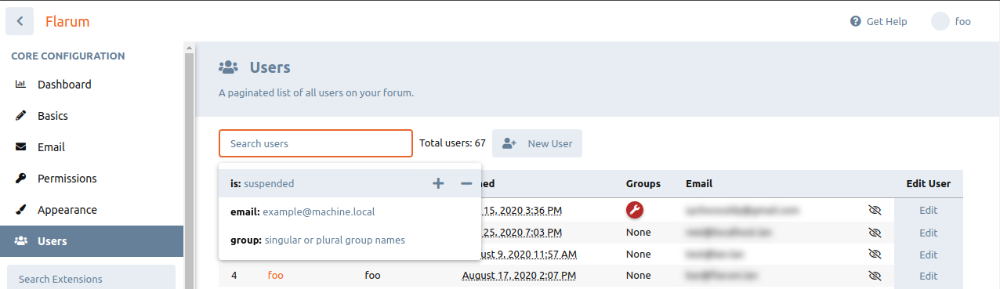

# 搜索

Flarum comes with a default simple search driver that uses MySQL's fulltext search capabilities. However, Flarum's search system is designed to be extensible, and you can easily add support for more advanced search drivers, such as ElasticSearch.

Flarum treats searching and filtering as the same process, but makes a distinction between them depending on the existence of a search query. Flarum will always use the default database search driver when only filters are provided, and will use the model's configured search driver when a search query is provided.

- Filtering is applied when the `filter[q]` query param is omitted. Filters represent **structured** queries: for instance, you might want to only retrieve discussions in a certain category, or users who registered before a certain date. Filtering computes results based entirely on `filter[KEY] = VALUE` query parameters.
- Searching is applied when the `filter[q]` query param is included. Searches represent **unstructured** queries: the user submits an arbitrary string, and data records that *match* it are returned. For instance, you might want to search discussions based on the content of their posts, or users based on their username. Searching computes results based primarily on the `filter[q]` query param. Searches aren't however entirely unstructured: the dataset being searched can still be constrained by filters.

This distinction is important because searches and filters have very different use cases: filters represent *browsing*: that is, the user is passively looking through some category of content. In contrast, searches represent, well, *searching*: the user is actively looking for content based on relevance to a query.

From this point forward we will refer to both as just searching as the system is one and the same.

## Searching Process

This section explains the internal process Flarum goes through when searching. You can skip this section if you're just looking to add searching to a new model, add a filter/mutator, or create a new search driver.

1. An Eloquent query builder instance for the model is obtained. This is provided by the per-model `Searcher` class's `getQuery()` method.
2. The query is constrained based on:
   1. A `Fulltext` filter, which is a special filter that is always applied when a search query is provided. This filter is responsible for the actual searching logic.
   2. `Filters` which constrain the results further. These are classes that implement `Flarum\Search\Filter\FilterInterface` and run depending on the request `filter` parameter.
      * We loop through all `filter[KEY]=VALUE` query params. For each of these, any `Filter`s registered to the model whose `getFilterKey()` method matches the query param `KEY` is applied. `Filter`s can be negated by providing the query param as `filter[-KEY] = VALUE`. Whether a `Filter` is negated is passed to it as an argument: implementing negation is up to the `Filter`s.
3. [Sorting](https://jsonapi.org/format/#fetching-sorting) and [pagination](https://jsonapi.org/format/#fetching-pagination) are applied.
4. Any *search mutators* are applied. These are callbacks that receive the search state *(a wrapper around the query builder and current user)* and search criteria, and perform some arbitrary changes. All mutators run on any request.
5. We calculate if there are additional matching model instances beyond the query set we're returning for this request, and return this value along with the actual model data, wrapped in a `Flarum\Search\SearchResults` object.

## Adding a filter & mutator for a searchable model

Let's say you've added a `country` column to the User model, and would like to filter users by country. We'll need to define a custom `Filter`: We'll need to define a custom `Filter`. Assuming you want to add this filter to the default database search driver:

```php
namespace YourPackage\Filter;

use Flarum\Search\Database\DatabaseSearchState;
use Flarum\Search\Filter\FilterInterface;
use Flarum\Search\SearchState;

/**
 * @implements FilterInterface<DatabaseSearchState>
 */
class CountryFilter implements FilterInterface
{
    public function getFilterKey(): string
    {
        return 'country';
    }

    public function filter(SearchState $state, string $filterValue, bool $negate)
    {
        $country = trim($filterValue, '"');

        $state->getQuery()->where('users.country', $negate ? '!=' : '=', $country);
    }
}
```

Note that `SearchState` is a wrapper around the Eloquent builder's underlying Query builder and the current user.

Also, let's pretend that for some reason, we want to omit any users that have a different country from the current user on ANY filter. We can use a "filter mutator" for this: We can use a *search mutator* for this:

```php
namespace YourPackage\Filter;

use Flarum\Search\Database\DatabaseSearchState;
use Flarum\Seach\SeachCriteria;

class OnlySameCountrySearchMutator
{
    public function __invoke(DatabaseSearchState $state, SearchCriteria $criteria)
    {
        $state->getQuery()->where('users.country', $state->getActor()->country);
    }
}
```

Now, all we need to do is register these via the search driver extender:

```php
use Flarum\Extend;
use Flarum\Search\Database\DatabaseSearchDriver;
use Flarum\User\Search\UserSearcher;

return [
  // Other extenders..

    (new Extend\SearchDriver(DatabaseSearchDriver::class))
        ->addFilter(UserSearcher::class, CountryFilter::class)
        ->addMutator(UserSearcher::class, OnlySameCountryFilterMutator::class),

  // Other extenders..
];
```

## Making a new model searchable

If you want to make a non-searchable model searchable *(for instance, your extension adds a new model)*, you'll need to create a searcher class for the model, by implementing the `Flarum\Search\SearcherInterface` interface. Assuming this is meant for the default database search driver, you can instead extend `Flarum\Search\Database\AbstractSearcher`:

```php
namespace YourPackage\Search;

use Flarum\Search\Database\AbstractSearcher;
use YourPackage\Model\Acme;

class AcmeSearcher extends AbstractSearcher
{
    public function getQuery(User $actor): Builder
    {
        return Acme::query()->select('acmes.*'); // The selection is recommended to avoid conflicts with other extensions.
    }
}
```

您可以为实际搜索创建一个全文过滤器实现。 这是一个在提供搜索查询时始终应用的特殊过滤器。 比如，如果你想通过`name`字段来搜索 Acme 模型的数据：

```php
namespace YourPackage\Search;

use Flarum\Search\AbstractFulltextFilter;
use Flarum\Search\Database\DatabaseSearchState;
use Flarum\Search\SearchState;

/**
 * @extends AbstractFulltextFilter<DatabaseSearchState>
 */
class AcmeFulltextFilter extends AbstractFulltextFilter
{
    public function search(SearchState $state, string $value): void
    {
        $state->getQuery()
            ->where('acmes.name', 'like', "%$value%");
    }
}
```

然后，您需要通过搜索驱动扩展来注册此搜索器：

```php
use Flarum\Extend;
use Flarum\Search\Database\DatabaseSearchDriver;

return [
  // Other extenders..

    (new Extend\SearchDriver(DatabaseSearchDriver::class))
        ->addSearcher(Acme::class, AcmeSearcher::class)
        ->setFullText(AcmeSearcher::class, AcmeFulltextFilter::class),

  // Other extenders..
];
```

## 创建一个新的搜索驱动

如果您想要创建一个新的搜索驱动器，您需要：

1. 首先创建扩展的 `Flarum\Search\AbstractDriver` 的驱动类。
2. 然后，对于您的驱动程序实现搜索的每个模型，您需要创建一个实现 `Flarum\Search\SearcherInterface` 的模型搜索类。
3. (*可选*) 您可以创建一个自定义搜索状态类，扩展 `Flarum\Search\SearchState` 以存储您需要的任何额外状态的驱动程序。
4. 请参阅上面的部分，以便为您的模型搜索者注册一个过滤器和/或一个完整的文本过滤器。
5. 最后，您需要通过 `SearchDriver` 注册您的驱动。

```php
namespace YourPackage\Search;

use Flarum\Search\AbstractDriver;

class AcmeSearchDriver extends AbstractDriver
{
    public static function name(): string
    {
        return 'your-package-driver-name';
    }
}
```

```php
use Flarum\Extend;

return [

    // Other extenders..

    (new Extend\SearchDriver(AcmeSearchDriver::class))
        ->addSearcher(Acme::class, AcmeSearcher::class)
        // Optionally, you can set a fulltext filter for your searcher, a filter and/or a mutator.
        ->setFullText(AcmeSearcher::class, AcmeFulltextFilter::class)
        ->addFilter(AcmeSearcher::class, AcmeFilter::class)
        ->addMutator(AcmeSearcher::class, AcmeMutator::class),

    // Other extenders..

];
```

您的模型搜索器和全文过滤器实现是您搜索驱动程序的特定逻辑运行的地方。 您将想要创建一个抽象的搜索器类来重新使用您所有模型搜索者的逻辑。

```php
namespace YourPackage\Search;

use Flarum\Search\SearcherInterface;
use Illuminate\Database\Eloquent\Builder;

abstract class AbstractAcmeSearcher implements SearcherInterface
{
    public function __construct(
        protected FilterManager $filters,
        /** @var array<callable> */
        protected array $mutators
    ) {
    }

    abstract public function getQuery(User $actor): Builder;

    public function search(SearchCriteria $criteria): SearchResults
    {
        // Your searching logic here.
    }
}
```

:::info

您可以检查 [默认数据库搜索驱动器实现](https://github.com/flarum/framework/blob/2.x/framework/core/src/Search/Database) 的示例如何实现搜索程序。

:::

## 索引

Flarum通过注意监听事件和在异步作业中运行你的索引器逻辑来简化索引模型的过程。 您需要做的只是实现 `Flarum\Search\IndexerInterface` 接口，并通过 `SearchIndex` 扩展程序注册它。

索引器不绑定到任何特定的搜索驱动器。 您可以为现有或新模型添加索引器。 但你的索引器的逻辑将针对指定的驱动程序。

```php
namespace YourPackage\Search;

use Flarum\Search\IndexerInterface;

class AcmeIndexer implements IndexerInterface
{
    public static function index(): string
    {
        return 'acmes';
    }

    public function save(array $models): void
    {
        // Save the models to the index.
    }

    public function delete(array $models): void
    {
        // Delete the models from the index.
    }

    public function build(): void
    {
        // Build the index.
    }

    public function flush(): void
    {
        // Flush the index.
    }
}
```

```php
use Flarum\Extend;

return [

    // Other extenders..

    (new Extend\SearchIndex())
        ->indexer(Acme::class, AcmeIndexer::class),

    // Other extenders..

];
```

:::info

查看更多示例的 [概念弹性搜索驱动程序](https://github.com/SychO9/flarum-ext-search)。

:::

## 配置模型驱动程序

您可以从高级管理页面选择搜索模型可以使用的驱动程序。 此页面需要从控制面板工具下拉的按钮切换：


## Gambits

Gambits 是通过搜索前台添加过滤器的一种方式。 Gambit的概念仅与前端有关，因为它们被用来将字符串查询转换成过滤器和过滤器返回其字符串格式。 例如，`is:unread` 筛选语法会对应转换为 `filter[unread]` 筛选器，反之亦然。

任何时候你调用 `app.store.find()` 并提供一个 `q` 过滤器都会应用 Gambits 。 For example:

```ts
app.store.find('discussions', { q: 'is:unread' });
```

在全局搜索的自动完成选项中，Gambits 会自动显示：


### 基本 gambits

要创建一个新的 gambit，请确定它是一个 `key:value` 类型的 gambit，还是布尔值为 `is:` 类型的 gambit。 如果它是前者，你可以创建一个扩展 `KeyValueGambit` 的类。 For example, the `country` column example we used earlier is a `key:value` gambit:

```ts
import app from 'flarum/common/app';
import { KeyValueGambit } from 'flarum/common/query/IGambit';

export default class CountryGambit extends KeyValueGambit {
  key(): string {
    return app.translator.trans('acme.lib.gambits.users.country.key', {}, true);
  }

  hint(): string {
    return app.translator.trans('acme.lib.gambits.users.country.hint', {}, true);
  }

  filterKey(): string {
    return 'country';
  }
}
```

The `key` is the localized gambit key, `country` would be the english word used, and other languages can appropriately translate. The key must have no spaces. The `hint` is used for the autocomplete in the global search modal. The implementation will produce a `filter[country]=value` filter. The filter key must not be localized.

If the gambit you are creating is a boolean `is:` type of gambit, you can extend the `BooleanGambit` class. Here is an example from a built-in gambit (The filter key must not be localized.):

```ts
import app from 'flarum/common/app';
import { BooleanGambit } from 'flarum/common/query/IGambit';

export default class UnreadGambit extends BooleanGambit {
  key(): string {
    return app.translator.trans('core.lib.gambits.discussions.unread.key', {}, true);
  }

  filterKey(): string {
    return 'unread';
  }
}
```

:::info No Spaces in Gambit Patterns!

Flarum splits the `filter[q]` string into tokens by splitting it at spaces. This means that your custom gambits can NOT use spaces as part of their pattern. This means that your custom gambits can NOT use spaces as part of their pattern.

:::

:::info Use the common frontend

Gambits may be used from both the forum and admin frontends. So you want to make sure your gambit is added within the common frontend.

:::

### Advanced gambits

If neither of the above gambit classes are suitable for your needs, you may directly implement the `IGambit` interface. Your class must implement the following:

###### `type`
The type of gambit. It can be `key:value` or `grouped`. The `key:value` gambit is a single key with a single value. The `grouped` gambit is a key with multiple values. For example, boolean gambits are grouped, because they are all prefixed with `is:`.
###### `pattern`
The regular expression pattern that will be used to match the gambit. The pattern language can be localized. For example, the pattern for the author gambit is `author:(.+)` in English, but `auteur:(.+)` in French.
###### `toFilter`
The method to transform a gambit into a filter format. The returned POJO will be combined into the filter POJO. For example, the author gambit will return `{ author: 'username' }`.
###### `filterKey`
The server standardised filter key for this gambit. The filter key must not be localized.
###### `fromFilter`
The method to transform a filter into a gambit format. The gambit format can be localized.
###### `suggestion`
Returns information about how the gambit is structured for the UI. Use localized values. For example, the author gambit will return `{ key: 'author', hint: 'the username of the author' }`.
###### `predicates`
Whether this gambit can use logical operators. For example, the tag gambit can be used as such: `tag:foo,bar tag:baz` which translates to `(foo OR bar) AND baz`. The info allows generation of the correct filtering format, which would be:
```json
{
  "tag": [
    "foo,bar", // OR because of the comma.
    "baz" // AND because it's a separate item.
  ]
}
```
The backend filter must be able to handle this format. Checkout the `TagGambit` and `TagFilter` classes for an example.
###### `已启用`
这个gambit是否可以被操作者使用。 某些过滤规则是受保护的，只能被某些行为者使用。 例如，`is:suspended` 这一筛选语法，仅允许拥有封禁用户权限的操作主体使用。

```ts
enabled(): bool {
  return !!app.session.user && app.forum.attribute('canSuspendUsers');
}
```

### 注册 gambit

一旦您创建了您的 gambit，您将需要注册它。 您可以使用 `Search` 前端扩展：

```ts
import Extend from 'flarum/common/extenders';
import CountryGambit from './query/users/CountryGambit';

// prettier-ignore
export default [
  new Extend.Search()
    .gambit('users', CountryGambit),
];
```

### 自动完成自定义输入

如果你有一个自定义输入框，且希望为它提供筛选语法gambit自动补全功能，那么可以使用 `GambitAutocompleteDropdown` 这个包装组件。 内置用户列表管理页面使用此组件。 下面是一个示例：

```tsx
import GambitsAutocompleteDropdown from 'flarum/common/components/GambitsAutocompleteDropdown';
import Input from 'flarum/common/components/Input';

<GambitsAutocompleteDropdown resource="users" query={this.query} onchange={onchange}>
  <Input
    type="search"
    placeholder={app.translator.trans('core.admin.users.search_placeholder')}
    clearable={true}
    loading={this.isLoadingPage}
    value={this.query}
    onchange={onchange}
  />
</GambitsAutocompleteDropdown>
```

这将自动生成一个自动完成的下拉列表，并且为 `users` 资源。 `query` 验证是当前的搜索查询， 和 `onchange` prop 是一个在查询发生变化时调用的回调。


