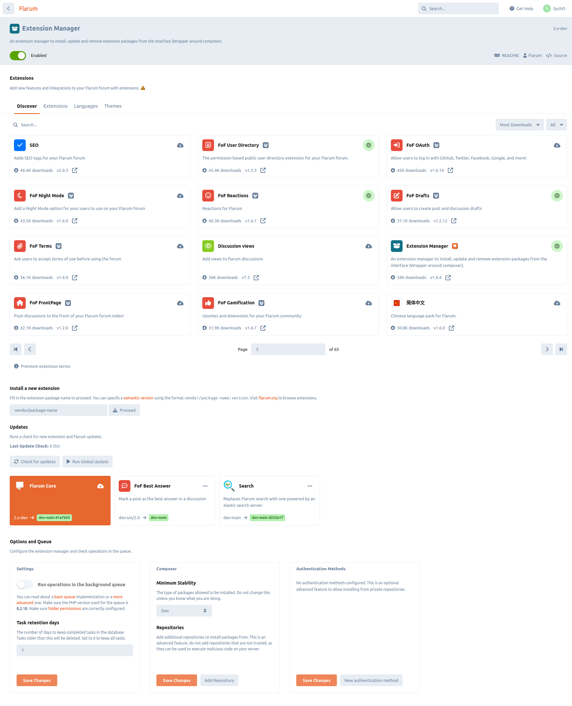
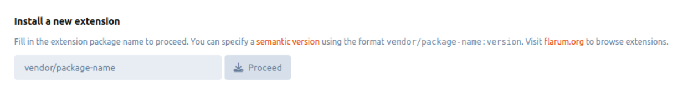
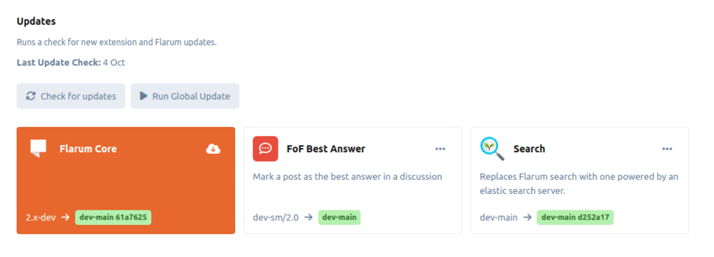
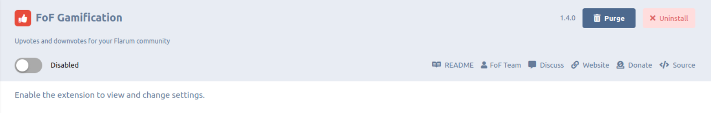
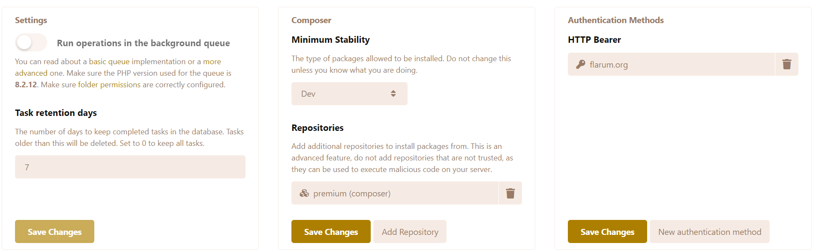

# 扩展程序

Flarum 是简约的，同时也是高度可扩展的。 实际上，Flarum 附带的大部分功能都是扩展程序。

这种方法使得 Flarum 具有极高的可定制性。 您可以禁用任何您不需要的功能，并安装其他扩展，打造更适合您的社区。

如果您想了解更多关于 Flarum 的理念，我们在核心中包含了哪些功能，或者您想制作自己的扩展，请查看我们的 [扩展文档](extend/README.md)。 本文将重点讨论从论坛管理员的角度管理扩展。

## 扩展管理器

The extension manager is an extension that comes bundled with Flarum when installed via an archive. It provides a graphical interface for installing and updating both extensions and Flarum itself. 它提供一个图形接口，用于安装和更新扩展和Flarum本身。

如果你没有安装扩展管理器并且你想要安装它， 您可以通过在您的 Flarum 目录中运行以下命令来这样做：

```bash
composer require flarum/extension-manager:"*"
```

:::warning

The extension manager allows an admin user to install any composer package. Only install the extension manager if you trust all of your forum admins with such permissions. 只有在您信任所有论坛管理员拥有此权限的情况下才安装扩展管理器

:::




## 寻找扩展

Flarum 有一个广泛的扩展生态系统，其中大部分是开源和免费的。 扩展管理器提供了一个发现功能，允许您通过可用的扩展进行搜索。 扩展管理器连接到 [flarum.org/extension](https://flarum.org/extensions) 或者，您可以在Flarum的社区论坛上访问 [扩展](https://discuss.flarum.org/t/extensions) 标签。

## 安装扩展

### 通过接口

使用扩展管理扩展，您可以直接从管理仪表盘安装扩展。 Using the extension manager extension, you can install extensions directly from the admin dashboard. Once you have browsed the list of available extensions from the links above, and found one you want to install, you can install it by entering the extension's composer package name into the extension manager's installation input.



### 通过命令行

与 Flarum 一样，扩展是使用 SSH 通过 [Composer](https://getcomposer.org) 安装的。 要安装一个典型的扩展：

1. `cd` to your Flarum directory. `cd` 到 `composer.json` 所在文件夹。 `cd` 到 `composer.json` 所在文件夹。 您可以通过 `ls -la` 查看目录下的文件。
2. 运行 `composer require COMPOSER_PACKAGE_NAME:*`. 具体安装命令一般可在扩展的文档中找到。 具体安装命令一般可在扩展的文档中找到。

## 管理扩展

### 通过接口

使用扩展管理扩展，您可以直接从管理仪表板更新扩展。 Using the extension manager extension, you can update extensions directly from the admin dashboard. You can run a check for updates by clicking the "Check for updates" button in the extension manager. If there are updates available, you can update all extensions by clicking the "Global update" button. Or, you can update individual extensions by clicking the "Update" button next to the extension you want to update. 如果有可用的更新，您可以点击“全局更新”按钮来更新所有扩展。 或者，您可以通过点击您想要更新的扩展旁边的“更新”按钮来更新单个扩展。



### 通过命令行

按照扩展开发者提供的说明操作。 如果你使用 `*` 作为扩展的版本字符串（[如推荐所示](composer.md)），运行[Flarum升级指南](update.md)中列出的命令应该会更新你的所有扩展。

## 卸载扩展

### 通过接口

使用扩展管理扩展，您可以直接从管理员面板卸载扩展。 Using the extension manager extension, you can uninstall extensions directly from the admin dashboard. You can uninstall an extension by clicking the "Uninstall" button next to the extension you want to uninstall inside the extension's page.



### 通过命令行

类似安装的步骤，若要移除扩展：

0. 如果你想移除由扩展创建的所有数据库表，请在管理员仪表板中点击"重置"按钮。 更多信息[见下](#managing-extensions)。
1. `cd` to your Flarum directory. `cd` 到 `composer.json` 所在文件夹。
2. 运行 `composer require COMPOSER_包名`。 具体安装命令一般可在扩展的文档中找到。

## 管理扩展

Each individual extension page of the admin dashboard provides a convenient way to manage the extension. 您可以： 您可以：

- 启用或禁用扩展。
- 查看扩展提供的设置并更改它们.
- 回滚一个扩展的迁移，以删除它所做的任何数据库修改（这可以通过重置按钮来完成）。 这将删除与该扩展相关的所有数据，并且是不可逆的。 只有当你要删除一个扩展程序，并且不打算再次安装它时，才应该这样做。 当然这不是非要做的事情，选择权在您手中。
- 如果有的话，请查看扩展的README。
- 查看扩展的版本。
- 如果已安装扩展管理器，请卸载该扩展。

## 配置其他扩展存储库源

The extension manager uses `composer` under the hood, and as such, it looks for extension packages in the same places as `composer`. By default, this is [Packagist](https://packagist.org/). However, you can configure additional sources for the extension manager to look for extensions in. This is useful if you want to install an extension that is not available on Packagist. 默认情况下，这是 [封装](https://packagist.org/)。 然而，您可以配置扩展管理器的额外源来查找扩展。 如果您想要安装一个在 Packagist 上不可用的扩展，这是有用的。

In the admin page of the extension manager, clicking the **Add Repository** button will open a modal where you can enter the name and URL of the repository you want to add. The name is just a label for the repository, and can be anything you want. The URL should be the URL of the repository which depends on the type of repository you want to add. 名称只是仓库的标签，可以是你想要的东西。 URL应该是仓库的 URL，取决于你想要添加的仓库类型。

### 从 VCS 添加仓库

If you want to add a repository from a VCS (e.g. GitHub, GitLab, BitBucket, etc), the URL should be the URL of the repository's VCS. For example, if you had a private GitHub repository at `https://github.com/acme/flarum-extension`, you would enter that URL into the URL field. If it is a private source, you will need to enter an authentication method through the **New authentication method** button. The token can be generated from your VCS provider's website, and the host should be the domain of the VCS provider (e.g. `github.com`). 例如，如果您在https://github.com/acme/flarum-extension，您可以在 URL 字段中输入该 URL。 如果是私有源，则需要通过“新建身份验证方法”按钮 令牌可以从您的 VCS 提供商的网站生成，并且主机应该是 VCS 提供商的域（例如github.com)。

### 添加 composer 存储库

Extiverse 提供对高级扩展的访问。 这是 composer 存储库的一个很好的示例。 您将指定网址为 `https://flarum.org/composer/` 名称为 `premium`。 您还需要通过**“新建认证方法”**按钮输入一个认证方法。 令牌可以从您的 Flarum 账户的[“订阅”](https://flarum.org/dashboard/subscriptions)页面通过“说明”按钮生成。

* 类型: `HTTP Bearer`
* 域名： `flarum.org`



:::info

The configured repositories and auth methods will be active for both the command line and the admin dashboard. If you configure them from the command line however, you must not include the flag `--global`. 但是，如果你从命令行配置了它们，你不能包含标志 `--global`。

:::

## 正在安装不稳定扩展

如果基于任何原因您想安装一个不稳定的扩展(例如： a beta, alpha 或 RC 版本)，您必须首先更新 **最小稳定性** 设置到想要的稳定性上。

* If you set it to Alpha, you will be able to install alpha, beta, RC (Release Candidate) and stable versions.
* If you set it to Beta, you will be able to install beta, RC and stable versions.
* If you set it to RC, you will be able to install RC and stable versions.
* If you set it to Stable, you will only be able to install stable versions.
